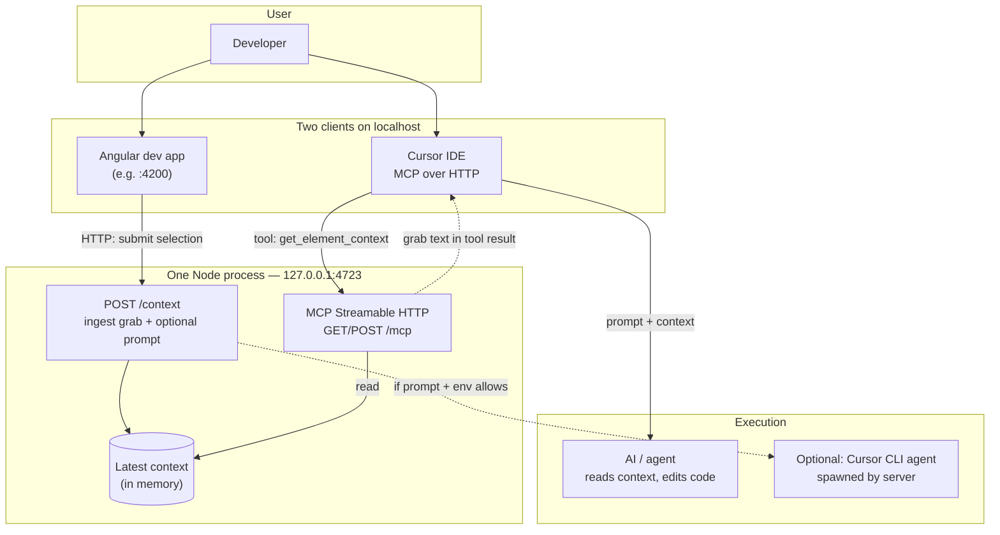

# Angular Grab MCP (local)

**Flow:** the dev app `POST`s grab text to `http://127.0.0.1:4723/context`. The same Node process serves **MCP** so your agent can read the latest grab via tool **`get_element_context`** — you can talk in plain language (“address my feedback”, “fix annotation 3”) without pasting from the clipboard.

### Workflow (prompt → execution)

Everything below runs **on your machine**. One **Node server** listens on **localhost**; the **browser** and **Cursor** are separate clients that both talk to it.



1. **You** grab UI in the app and **Send** (or rely on auto-post): the app **POST**s to **`/context`** on the local server.
2. **Cursor** connects to the **same** process at **`http://127.0.0.1:4723/mcp`**. When chat or the agent runs **`get_element_context`**, the server reads what was stored and the model can act on it (**prompt → execution** in the IDE).
3. **Optional:** for some submissions the server may **spawn** the Cursor **`agent`** CLI (see env vars below); that path runs **outside** the IDE chat panel but still uses the stored context.

## In the Angular app

- **Click** while grabbing: selection + element context → MCP (+ clipboard).
- **Shift+click**: **full page** (URL, title, visible text excerpt, component stack) → MCP (+ clipboard).
- **Send** in the panel: posts instruction + context to MCP again; clipboard copy is skipped when MCP succeeds so you are not duplicating paste steps.

## Run the server

This package lives under **`packages/angular-grab-mcp`**. With **npm workspaces**, its dependencies are declared here and installed from the **repository root** (`npm install` once at the repo root; modules are typically hoisted to the root `node_modules`).

```bash
npm run angular-grab-mcp
```

Port **4723** busy with old code?

```bash
npm run angular-grab-mcp:force
```

Register MCP with Cursor (repo root): `npm run angular-grab -- add mcp -y` — then restart Cursor. **Cursor uses HTTP** `http://127.0.0.1:4723/mcp` so it shares the same process as the browser `POST /context`.

### Environment (optional CLI spawn)

| Variable | Default | Meaning |
|----------|---------|---------|
| `ANGULAR_GRAB_AUTO_AGENT` | *(on)* | `0` / `false` = only store for MCP, do not spawn `agent`. |
| `ANGULAR_GRAB_AGENT_BIN` | `agent` | Override path to Cursor CLI binary. |

`POST /context` response may include `cursorAgent` when an instruction is present.

### Health

`GET http://127.0.0.1:4723/health` → `{"status":"ok"}`.
